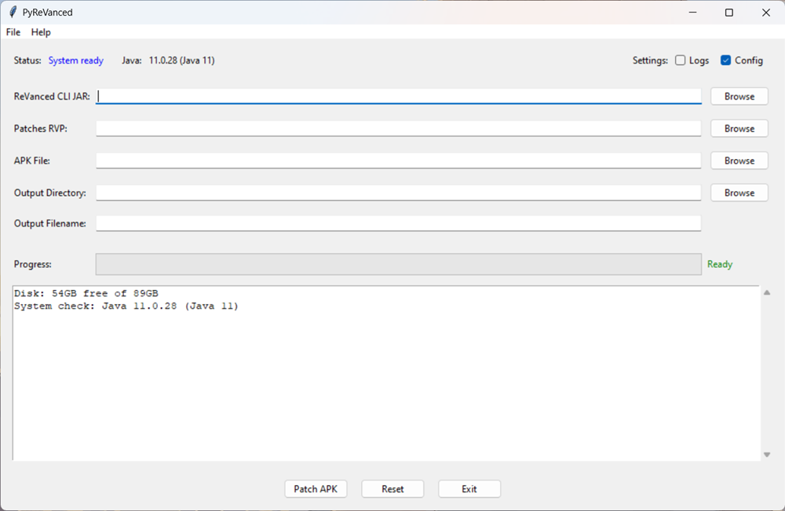
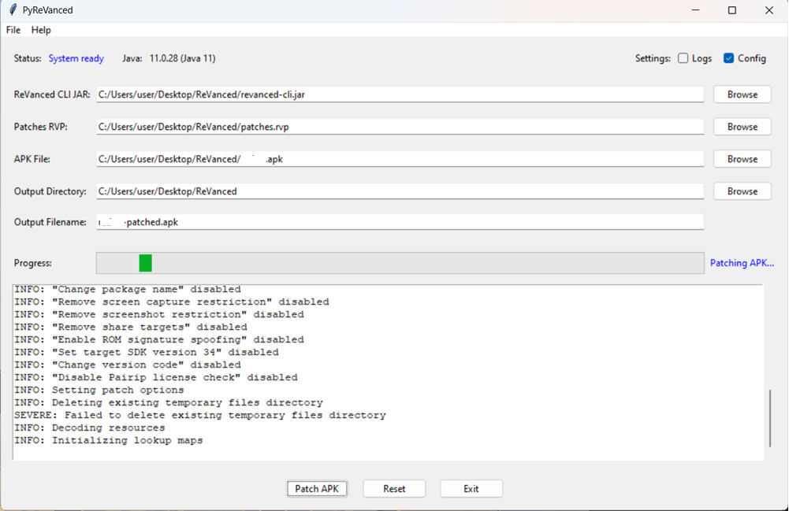

# PyReVanced

A comprehensive Python GUI wrapper for the ReVanced CLI tool that provides an easy-to-use interface for patching APK files with ReVanced patches.


## Features

- **User-Friendly GUI**: Clean, intuitive interface built with tkinter
- **System Validation**: Automatic Java version and system requirements checking
- **Real-time Progress**: Live progress tracking with detailed logging
- **Configuration Persistence**: Remembers your settings and file paths
- **System Monitoring**: Resource usage monitoring with warnings
- **Export Logs**: Save patching logs for troubleshooting
- **Cross-Platform**: Works on Windows, macOS, and Linux

## Screenshots

### Main Interface



### Patching Process




## Requirements

### System Requirements

- **Python**: 3.8 or higher
- **Java**: 8 or higher (Java 11+ recommended for ReVanced CLI)
- **Operating System**: Windows, macOS, or Linux

### Required Dependencies

- `tkinter` (included with Python)

### Optional Dependencies

- `psutil>=5.9.0` - For system monitoring and resource usage

## Installation

### 1. Clone the Repository

```bash
git clone https://github.com/HelllGuest/PyReVanced.git
cd PyReVanced
```

### 2. Install Dependencies

```bash
# Install required dependencies
pip install -r requirements.txt

# Or install manually
pip install psutil
```

### 3. Verify Java Installation

Make sure Java is installed and accessible:

```bash
java -version
```

## Usage

### Quick Start

1. **Run the application**:

   ```bash
   python main.py
   ```

2. **Select required files**:

   - ReVanced CLI JAR file
   - Patches RVP file
   - APK file to patch

3. **Start patching**:
   - Click "Patch APK" button
   - Monitor progress in the log area

### Detailed Steps

#### 1. Get Required Files

Before using PyReVanced, you need:

- **ReVanced CLI JAR**: Download from [ReVanced CLI Releases](https://github.com/revanced/revanced-cli/releases)
- **Patches RVP**: Download from [ReVanced Patches Releases](https://github.com/revanced/revanced-patches/releases)
- **APK File**: The original APK you want to patch

#### 2. Using the Interface

**File Selection Methods**:

- **Browse Button**: Click "Browse" next to each field
- **Manual Entry**: Type or paste file paths directly

**Automatic Features**:

- Output directory automatically matches APK file location
- Output filename gets "-patched" suffix automatically
- JAR and RVP paths are remembered between sessions

#### 3. Settings

**Logs Setting**:

- Enable to save detailed logs to `logs/` directory
- Useful for troubleshooting failed patches

**Config Setting**:

- Enable to save your preferences and file paths
- Restores window size and position

### Command Line Interface

While PyReVanced provides a GUI, you can also see the underlying command it executes:

```bash
java -jar revanced-cli.jar patch -p patches.rvp -o output-patched.apk input.apk
```

## File Structure

```
PyReVanced/
├── main.py                 # Application entry point
├── requirements.txt        # Python dependencies
├── README.md              # This file
├── LICENSE                # MIT license
├── screenshots/           # Screenshots for README
├── src/
│   ├── __init__.py        # Package initialization
│   ├── revanced_gui.py    # Main application class
│   ├── core/              # Core functionality
│   │   ├── __init__.py
│   │   ├── config.py      # Configuration management
│   │   ├── java_manager.py # Java detection and validation
│   │   ├── patcher.py     # APK patching functionality
│   │   └── system_monitor.py # System monitoring
│   └── ui/                # User interface components
│       ├── __init__.py
│       ├── main_window.py # Main GUI window
│       └── dialogs.py     # Help and About dialogs
├── logs/                  # Generated log files (when enabled)
└── config.json           # Configuration file (when enabled)
```

## Configuration

PyReVanced automatically creates a `config.json` file to store:

- File paths (CLI JAR, Patches RVP, Output directory)
- Window geometry and position
- User preferences (logging, config saving)

Example configuration:

```json
{
  "save_logs_enabled": true,
  "save_config_enabled": true,
  "last_cli_path": "/path/to/revanced-cli.jar",
  "last_patches_path": "/path/to/patches.rvp",
  "last_output_dir": "/path/to/output",
  "window_geometry": "1000x600+100+100",
  "version": "1.0"
}
```

## Troubleshooting

### Common Issues

**Java Not Found**

```
Error: Java not found in PATH
Solution: Install Java 8+ and ensure it's in your PATH
```

**Patching Failed**

```
Error: Patching failed with return code 1
Solution: Ensure APK version matches the patches version
```

**Low Disk Space**

```
Warning: Low disk space: 1GB free
Solution: Free up disk space or use a smaller APK
```

**Missing Dependencies**

### Getting Help

1. **Check the logs**: Enable logging in settings for detailed error information
2. **Export logs**: Use File → Export Log to save troubleshooting information
3. **System status**: Check the status bar for system information
4. **Help dialog**: Use Help → Help Contents for usage instructions

### Debug Mode

For advanced troubleshooting, you can run with Python's verbose mode:

```bash
python -v main.py
```

## Development

### Setting Up Development Environment

1. **Clone and setup**:

   ```bash
   git clone https://github.com/HelllGuest/PyReVanced.git
   cd PyReVanced
   pip install -r requirements.txt
   ```

2. **Code structure**:

   - `src/core/` - Backend functionality
   - `src/ui/` - Frontend components
   - `main.py` - Entry point

3. **Adding features**:
   - Core functionality goes in `src/core/`
   - UI components go in `src/ui/`
   - Follow the existing patterns for consistency

### Contributing

1. Fork the repository
2. Create a feature branch
3. Make your changes
4. Test thoroughly
5. Submit a pull request

## License

This project is licensed under the MIT License - see the [LICENSE](LICENSE) file for details.

## Disclaimer

This is an unofficial GUI wrapper for ReVanced CLI. Use ReVanced responsibly and in accordance with the terms of service of the applications you're modifying.

## Acknowledgments

- [ReVanced Team](https://github.com/revanced) for the amazing ReVanced project
- [ReVanced CLI](https://github.com/revanced/revanced-cli) for the command-line interface
- [ReVanced Patches](https://github.com/revanced/revanced-patches) for the patch collections

## Links

- **ReVanced Project**: [Official ReVanced](https://github.com/revanced)
- **CLI Downloads**: [ReVanced CLI Releases](https://github.com/revanced/revanced-cli/releases)
- **Patches**: [ReVanced Patches Releases](https://github.com/revanced/revanced-patches/releases)

---

**Author**: Anoop Kumar  
**Version**: 1.0  
**License**: MIT
